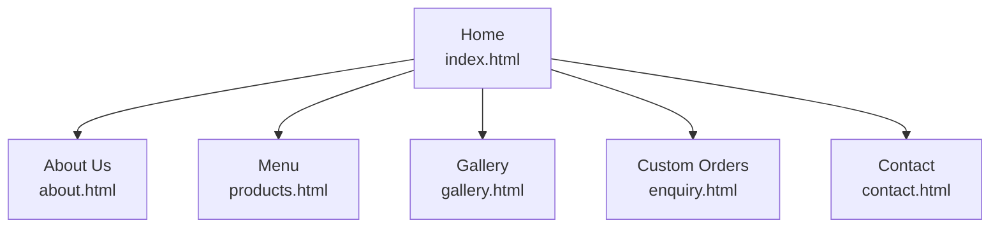

# Sollie's Bakery Website

## Student Information

| | |
|---|---|
| **Module** | Web Development Fundamentals (WEDE5020w) |
| **Student Name** | Nhlayiseko Chauke |
| **Student Number** | ST10507277 |
| **Target Organisation** | Sollie's Bakery (Small Business &ndash; Baker) |

---

## Project Overview

Sollie's Bakery is a small, family-run bakery established in 2019 in Johannesburg, South Africa,
serving fresh bread, pastries and custom celebration cakes to the local community. The bakery
currently has no dedicated website and relies solely on a basic Facebook page and word-of-mouth
referrals to reach customers.

This project delivers a professional, always-available website for Sollie's Bakery that gives the
business a proper online presence: a place to showcase its story and products, list opening hours
and location clearly, and give customers an easy way to enquire about custom cake orders.

The project is being delivered in three parts:

1. **Part 1 &ndash; Building the Foundation:** project planning, research, file structure, and
   semantic HTML structure for all pages *(current phase)*.
2. **Part 2 &ndash; Designing the Visuals:** CSS styling, responsive layout, and UX refinement.
3. **Part 3 &ndash; Adding Functionality and SEO:** JavaScript interactivity, form validation, SEO
   optimisation, and embedded external services (e.g. Google Maps).

---

## Website Goals and Objectives

The website will give the bakery a professional presence that is always available, beyond social
media. Specific goals include:

- Increase local brand visibility and attract new customers searching online for bakeries near them.
- Generate leads and enquiries for custom orders (celebration cakes, catering, corporate gifting).
- Provide essential information quickly: menu, prices, location, and opening hours.

**Key Performance Indicators (KPIs):**

- A minimum of 300 unique website visitors per month within the first three months.
- At least 15 custom order enquiries submitted via the contact form per month.
- An average session duration of two minutes or more, indicating genuine engagement with content.

---

## Key Features and Functionality

| Page | File | Purpose |
|---|---|---|
| Home | `index.html` | Hero banner, brief introduction, featured products, customer testimonials |
| About Us | `about.html` | Bakery history, mission and vision, team introduction |
| Menu | `products.html` | Categorised bread, pastries and cakes with descriptions and prices |
| Gallery | `gallery.html` | Photographs of finished cakes and daily products *(additional page)* |
| Custom Orders | `enquiry.html` | Enquiry form for custom cake, catering and event orders |
| Contact | `contact.html` | Contact details, opening hours, two business locations, general enquiry form |

All pages share a consistent header, navigation menu, and footer (address, hours, social link) so
that any page on the site is reachable from any other page.

**Note:** the Gallery page is not one of the five core pages listed in the Part 1 brief. It has
been added to fulfil the "Gallery" feature promised in the Website Project Proposal, bringing the
total to six pages.

---

## Timeline and Milestones

| Milestone | Key Deliverables | Target Date |
|---|---|---|
| Part 1: Planning & Proposal | Approved project proposal, research, and file structure | 14 August 2026 |
| Part 1: Foundation | HTML structure for all core pages | 14 August 2026 |
| Part 2: Visual Design | CSS styling, responsive layout, UX refinements | 18 September 2026 |
| Part 3: Functionality & SEO | JavaScript features, SEO optimisation, functional forms | 18 September 2026 |

---

## Part 1 Details

Part 1 (Building the Foundation) covered:

- **Project planning:** target audience, goals, KPIs and current-website analysis, documented in
  the Website Project Proposal.
- **Research and content gathering:** bakery history, product/menu content, and imagery
  requirements identified and organised.
- **File and folder structure:** a clean root folder containing all HTML files plus `css/`, `js/`,
  and `images/` subfolders (styling and scripting to follow in Parts 2 and 3).
- **HTML structure:** six semantic HTML5 pages (`index.html`, `about.html`, `products.html`,
  `gallery.html`, `enquiry.html`, `contact.html`), each using `header`, `nav`, `main`, `section`,
  `article`, `figure`, and `footer` elements, with a consistent, functional navigation menu across
  every page. No CSS or JavaScript has been added yet, per the Part 1 scope.
- **Comments:** HTML comments included throughout to explain the purpose of each section and any
  assumptions made (e.g. placeholder contact details, the second business location).

*(Part 2 and Part 3 details will be added here as those phases are completed.)*

---

## Sitemap



A rendered version of this diagram is also included as an image at
[`images/sitemap.svg`](images/sitemap.svg).

All five secondary pages sit one level below the homepage and link back to every other page via
the shared navigation menu, keeping every page &mdash; including the enquiry form &mdash; within a
single click of any other page, in line with the proposal's UX goals.

---

## File and Folder Structure

```
sollies-bakery/
├── index.html          Home page
├── about.html           About Us page
├── products.html        Menu / Products page
├── gallery.html          Gallery page (additional)
├── enquiry.html          Custom order enquiry page
├── contact.html          Contact page
├── css/                  Stylesheets (to be added in Part 2)
├── js/                   Scripts (to be added in Part 3)
├── images/               Product, gallery, team photos, and sitemap.svg
├── README.md             This file
└── Sollie's Bakery Website Project Proposal.pdf
```

---

## Changelog

### Part 1 &ndash; 2026-08-14
- Set up root project folder and `css/`, `js/`, `images/` subfolders.
- Added the Website Project Proposal document.
- Created six semantic HTML5 pages: `index.html`, `about.html`, `products.html`, `gallery.html`,
  `enquiry.html`, `contact.html`.
- Implemented a consistent, site-wide navigation menu (header + nav) and footer across all pages.
- Added a custom order enquiry form (`enquiry.html`) and a general contact form with opening
  hours and two business locations (`contact.html`).
- Added explanatory HTML comments throughout the codebase.
- Documented the sitemap, file structure, and key features in this README.

### Part 2 &ndash; *(not yet started)*
- CSS styling, responsive layout and UX refinements to be logged here.

### Part 3 &ndash; *(not yet started)*
- JavaScript functionality, SEO optimisation and embedded services to be logged here.

---

## References

MOZILLA DEVELOPER NETWORK, 2026. *HTML: A good basis for accessibility.* [online] Available at:
<https://developer.mozilla.org/en-US/docs/Web/HTML> [Accessed 9 August 2026].

W3C, 2023. *Web Content Accessibility Guidelines (WCAG) 2.2.* [online] Available at:
<https://www.w3.org/TR/WCAG22/> [Accessed 30 July 2026].

XNEELO, 2026. *Web hosting and domain pricing.* [online] Available at: <https://xneelo.co.za>
[Accessed 30 July 2026].

*(Additional references used for images, icons, code snippets, and text content will be appended
here as they are sourced in Parts 2 and 3.)*
