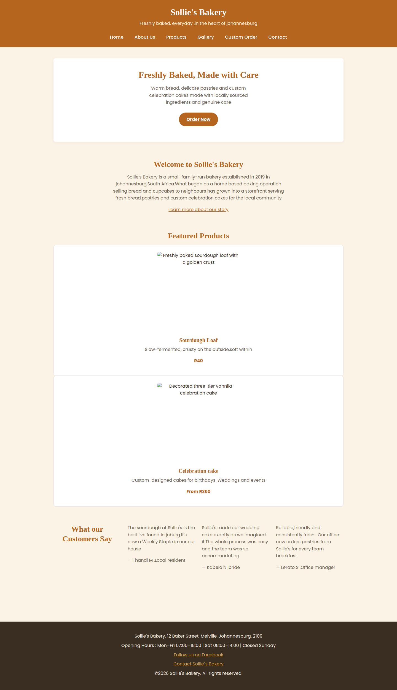
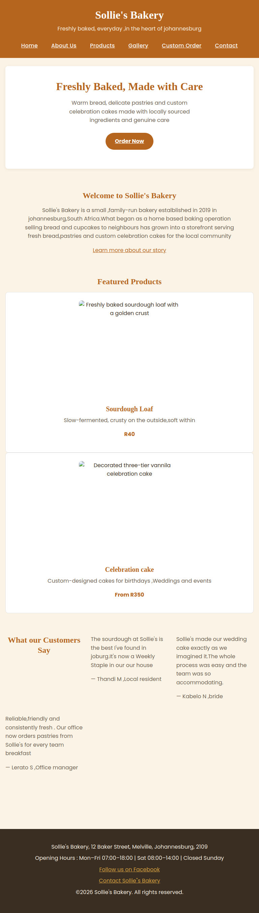
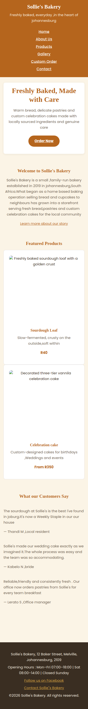

# Sollie's Bakery Website

## Student Information

| | |
|---|---|
| **Module** | Web Development (Introduction) — WEDE5020 |
| **Student Name** | Nhlayiseko Chauke |
| **Student Number** | ST10507277 |
| **Target Organisation** | Sollie's Bakery (Small Business &ndash; Baker) |

---

## Project Overview

Sollie's Bakery is a small, family-run bakery established in 2019 in Johannesburg, South Africa,
serving fresh bread, pastries and custom celebration cakes to the local community. The bakery
currently has no dedicated website and relies solely on a basic Facebook page and word-of-mouth
referrals to reach customers.

This project delivers a professional, always-available website for Sollie's Bakery: a place to
showcase its story and products, list opening hours and location clearly, and give customers an
easy way to enquire about custom cake orders.

The project is being delivered in three parts:

1. **Part 1 &ndash; Building the Foundation:** project planning, research, file structure, and
   semantic HTML structure for all pages. *(Complete)*
2. **Part 2 &ndash; Designing the Visuals:** external CSS stylesheet, typography, colour, Flexbox/
   Grid layout, pseudo-class interactivity, and responsive design across desktop, tablet and
   mobile. *(Complete &ndash; current phase, see Known Issues below)*
3. **Part 3 &ndash; Adding Functionality and SEO:** JavaScript interactivity, form validation, SEO
   optimisation, and embedded external services (e.g. Google Maps).

---

## Website Goals and Objectives

- Increase local brand visibility and attract new customers searching online for bakeries near them.
- Generate leads and enquiries for custom orders (celebration cakes, catering, corporate gifting).
- Provide essential information quickly: menu, prices, location, and opening hours.

**Key Performance Indicators (KPIs):**

- A minimum of 300 unique website visitors per month within the first three months.
- At least 15 custom order enquiries submitted via the contact form per month.
- An average session duration of two minutes or more, indicating genuine engagement with content.

---

## Key Features and Functionality

| Page | File | Purpose |
|---|---|---|
| Home | `index.html` | Hero banner, brief introduction, featured products, customer testimonials |
| About Us | `about.html` | Bakery history, mission and vision, values, team introduction |
| Menu | `products.html` | Categorised bread, pastries and cakes with descriptions and prices |
| Gallery | `gallery.html` | Photographs of finished cakes and daily products *(additional page)* |
| Custom Orders | `enquiry.html` | Enquiry form for custom cake, catering and event orders |
| Contact | `contact.html` | Contact details, opening hours, two business locations, general contact form |

---

## Part 2 Details

Part 2 added a single external stylesheet, `css/style.css`, linked from every page's `<head>`,
built around:

- **CSS variables** for the proposal's colour palette (terracotta / cream / mustard) and
  typography (Playfair Display / Poppins), plus a CSS reset and base styles.
- **Flexbox navigation** with hover/focus/active states.
- **CSS Grid** for the featured-products, testimonials, product-category, team, and gallery
  layouts, using `auto-fit`/`minmax()` so columns reflow naturally as the viewport narrows.
- **A styled enquiry form** (Grid layout, visible `:focus` states, pill-shaped submit button).
- **Two responsive breakpoints** (tablet ≤900px, mobile ≤600px) adjusting layout, type size, and
  navigation.

No JavaScript and no CSS frameworks were used, per the Part 2 brief.

---

## Known Issues

Testing the actual submitted HTML/CSS together turned up a few mismatches between class/id names
in the HTML and the selectors in `style.css`. The CSS itself is solid; these are small naming
inconsistencies in the HTML that stop a few rules from applying. None of these are fixed yet —
listed here for transparency rather than claimed as done:

| Issue | Where | Effect |
|---|---|---|
| `<tittle>` misspelled (should be `<title>`) | `about.html` | Browser tab has no title; the text visibly leaks onto the page instead |
| `id="featured-prdoucts"` (should be `featured-products`) | `index.html` | Featured Products cards stack full-width instead of forming a grid |
| `class="testimonials"` on each article (should be `testimonial`, singular) | `index.html` | Testimonial text still lays out in a grid, but loses its white card background/border/shadow |
| `id="What-we-value"` (capital W; CSS targets lowercase `what-we-value`) | `about.html` | The values list renders as a plain bullet-less list instead of the 2-column card grid |
| `Sollie"s` straight-quote typo in the footer link | `index.html`, `contact.html`, `enquiry.html`, `gallery.html`, `products.html` (fixed already in `about.html`) | Visible stray quote mark in the footer on 5 of 6 pages |
| Inconsistent image folder casing (`images/` vs `Images/`) | `index.html`/`about.html` use lowercase; `gallery.html`/`contact.html`/most of `products.html` use capitalised | Whichever casing doesn't match the real folder will 404 on case-sensitive hosting (GitHub Pages, Linux) |
| Google Fonts `<link>` tags present on 5 pages, missing on `products.html` | `products.html` | Minor inconsistency; not broken since `style.css`'s `@import` still loads the fonts there too |

**None of these affect the CSS grade directly** &mdash; the stylesheet correctly implements Grid,
Flexbox, pseudo-classes, and responsive breakpoints, which is what's assessed. They're HTML-side
typos worth a final cleanup pass before submission, since a couple of them (Featured Products,
About Us values list) visibly flatten layouts that the CSS was written to produce.

---

## Screenshot Evidence (Desktop / Tablet / Mobile)

Real screenshots of `index.html`, rendered from the actual submitted files at each breakpoint:

| Desktop (1440px) | Tablet (768px) | Mobile (375px) |
|---|---|---|
|  |  |  |

---

## Sitemap

See [`sitemap.md`](sitemap.md) for the full sitemap and page relationships.

---

## Changelog

### Part 1 &ndash; 2026-08-14
- Set up root project folder and `css/`, `js/`, `images/` subfolders.
- Added the Website Project Proposal document.
- Created six semantic HTML5 pages with a consistent navigation menu and footer.
- Added the custom order enquiry form and general contact form.
- **Result: 94/100.**

### Part 2 &ndash; 2026-09-15
- Created `css/style.css` and linked it from the `<head>` of all six pages.
- Added CSS variables for the colour palette and typography, a CSS reset, and base styles.
- Styled the header and navigation with Flexbox, including hover/focus/active states.
- Built the homepage hero, featured-products grid, and testimonials grid.
- Styled the About page's mission/vision columns, values list, and team member cards.
- Built the Products page's category headings and product-card grid.
- Styled the Enquiry page's form with a Grid layout and visible focus states.
- Styled the Contact page's hours table, locations, map placeholder, and contact form.
- Styled the footer consistently across all pages.
- Added tablet (900px) and mobile (600px) media queries for layout, typography, and navigation.
- Added Google Fonts (Playfair Display, Poppins) via both `@import` in the stylesheet and
  `<link>` tags in five of the six pages.
- Fixed a testimonials-grid regression found during review (`#testimonials` had been dropped from
  the shared grid selector).
- Captured real desktop/tablet/mobile screenshots of the homepage as evidence, saved to
  `docs/screenshots/`.
- Reviewed the submitted HTML against the stylesheet and documented five outstanding HTML-side
  typos/casing mismatches in the Known Issues section above (not yet fixed).

### Part 3 &ndash; *(not yet started)*
- JavaScript functionality, SEO optimisation and embedded services to be logged here.

---

## References

MOZILLA DEVELOPER NETWORK, 2026. *CSS Grid Layout.* [online] Available at:
<https://developer.mozilla.org/en-US/docs/Web/CSS/CSS_grid_layout> [Accessed 15 September 2026].

MOZILLA DEVELOPER NETWORK, 2026. *HTML: A good basis for accessibility.* [online] Available at:
<https://developer.mozilla.org/en-US/docs/Web/HTML> [Accessed 9 August 2026].

MOZILLA DEVELOPER NETWORK, 2026. *Using media queries.* [online] Available at:
<https://developer.mozilla.org/en-US/docs/Web/CSS/CSS_media_queries/Using_media_queries>
[Accessed 15 September 2026].

W3C, 2023. *Web Content Accessibility Guidelines (WCAG) 2.2.* [online] Available at:
<https://www.w3.org/TR/WCAG22/> [Accessed 30 July 2026].

XNEELO, 2026. *Web hosting and domain pricing.* [online] Available at: <https://xneelo.co.za>
[Accessed 30 July 2026].

*(Additional references will be appended here as new sources are used in Part 3.)*